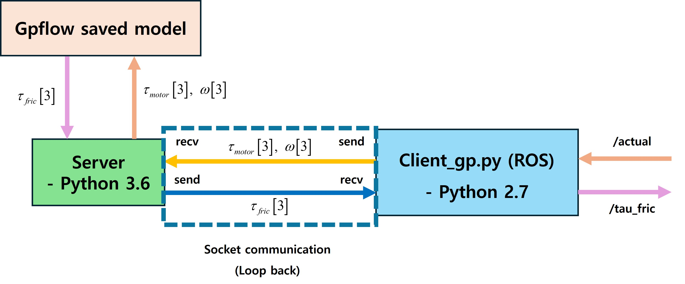

# Sparse GP flow

## Overview



## GPU FAN Setup

```
sudo jetson_clocks --fan
```

## Run

1. run SGPflow saved model.
```
python3 server.py
```

2. Put clinet_gp into ~/catkin_ws/src 

3. Activate client_gp.py

```
chmod +x client_gp.py
```

4. Run client_gp.py

```
rosrun clinet_gp client_gp.py
```

5. The node subscribes to "/actual"

6. It publishes "/tau_fric" (msg_pkg/tau_fric)


## Ground truth


## Sparse GPflow result


